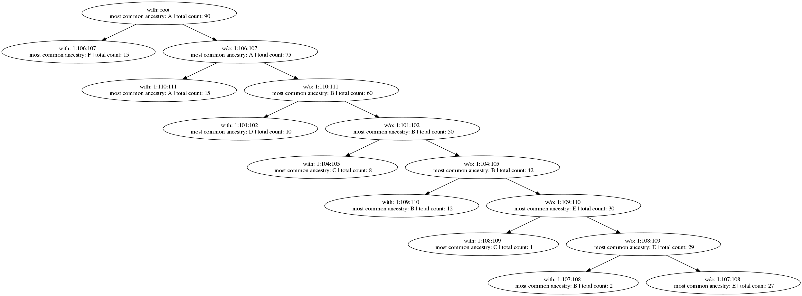

# ID3 Decision Tree Classifier with candig_server

[](https://travis-ci.com/CanDIG/id3-variants-training)

An ID3 Decision Tree Classifier that is used to interract with the candig_server (https://github.com/CanDIG/candig-server). The classifier is implemented in such a way so that it allows differential privacy to protect personal health information (PHI).

There is also a ConfusionMatrix class which is used to determine the accuracy of the decision tree.

## Quickstart

### Prerequisites

- *nix environment
- Python 3.7+
- [Graphviz](https://graphviz.org/download/)

### Setup and installation

Clone the repository locally and go to the root level of the repository. Create a virtual environment and activate it:
```
python3 -m venv venv
. venv/bin/activate
```

Install the program:
```
pip install .
```

### Usage

```
usage: train-id3 [-h] [--diagram DIAGRAM] [--use-candig-apis]
                 config_file model_file

positional arguments:
  config_file        path to the config file that contains variant ranges in
                     JSON format
  model_file         path to output ID3 file

optional arguments:
  -h, --help         show this help message and exit
  --diagram DIAGRAM  if provided, output diagram of tree to this file
  --use-candig-apis  use remote API to access variant information rather than
                     local VCF files
```

```
usage: predict-id3 [-h] config_path model_file

positional arguments:
  config_path  path to the config file that contains vcf file paths
  model_file   path to output ID3 file

optional arguments:
  -h, --help   show this help message and exit
```

### Examples

The following command will use `test_cases/case3/config.json` as the configuration file and
save the trained model in a file called `model_id3`. It will also create a diagram of the decision tree
and save it in a file called `id3_diagram.png`.
```
train-id3 test_cases/case3/config.json model_id3 --diagram=id3_diagram.png
```

`id3_diagram.png` will contain the following image:


The following command will use `test_cases/case3/test-config.json` as the configuration file and
use the trained model stored in `model_id3`.
```
predict-id3 test_cases/case3/test-config.json model_id3
```

The command will output:
```
[14  0  1  0  0  0]
[0 5 1 0 9 0]
[ 0  3 12  0  0  0]
[ 0  0  0 14  1  0]
[ 0  0  0  0 15  0]
[ 0  0  0  0  0 15]
0.8333333333333334
```